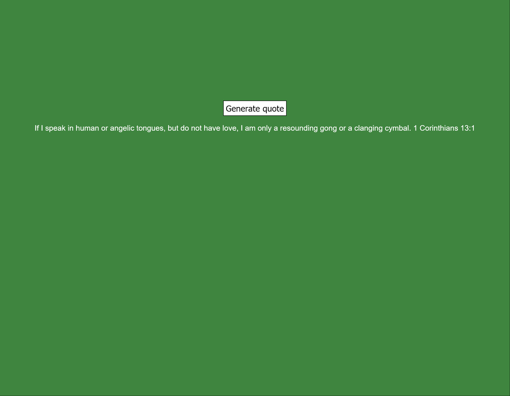

# js-random-quotes
JS Challenge 3

Exercise 3 from the 100+ Javascript projects page (https://jsbeginners.com/javascript-projects-for-beginners/)

This code takes a random quote from an array and display it on the page via refreshing the page or clicking a button.

